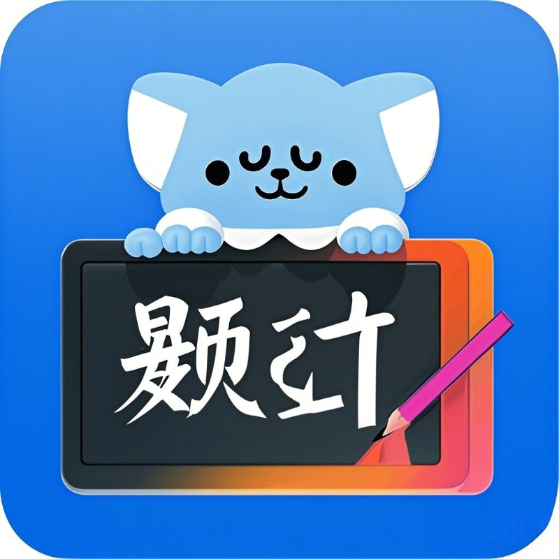

# 应知刷题小程序 - 计算机知识在线学习平台



## 项目概述

应知刷题小程序是一款专注于计算机知识学习的微信小程序，提供多种练习模式、AI 辅助学习、社区交流等功能，帮助用户高效备考计算机相关考试。目前包含硬件、软件、网络、信创等多个知识领域的题目，支持顺序刷题、随机抽题、章节练习、模拟考试等多种学习模式。

**当前版本**：2.6.0  
**下一版本**：3.0

## 主要功能

### 📝 题目练习

- **顺序刷题**：按照预设顺序练习，支持断点续练
- **随机抽题**：从题库随机抽取试题进行练习
- **章节练习**：按知识点分类进行专项训练
- **错题本**：自动收集错题，支持专项练习和云端同步
- **收藏夹**：可收藏重要题目，支持云端同步
- **答题闯关**：关卡式学习，难度逐级递增
- **自我挑战**：自定义题目数量、时长的专项练习
- **题目搜索**：支持关键词搜索题目

### 🧠 AI 辅助学习

- **AI 辅助刷题**：AI 实时解析题目，提供解题思路和知识扩展
- **学习助手**：支持深度问答，解决学习疑难
- **题目分析**：对错题进行智能分析，总结知识短板
- **多模型支持**：集成Kimi和智脑等多个AI模型

### 📊 考试模拟

- **模拟考试**：模拟真实考试环境，限时答题
- **万维调考**：定期更新的模拟考试试卷
- **成绩分析**：考试后提供详细的成绩分析报告
- **错题回顾**：支持考试后错题重做

### 🏆 积分与排名

- **积分系统**：完成各类学习任务获取积分
- **段位晋升**：积分达到一定数量可晋升段位
- **排行榜**：支持综合、答题数量、准确率等多维度排名
- **每日签到**：每日签到获得积分奖励

### 👥 社区功能

- **交流室**：用户间实时交流，讨论学习问题
- **QQ 交流群**：提供多个 QQ 群供用户交流
- **社区问答**：用户可在社区提问并获得回答

### 📚 资源共享

- **资源中心**：分享考试资料、政策文件等学习资源
- **知识文档**：重要知识点整理和分享

### 🌙 夜间模式

- **全局深色主题**：保护眼睛，适合夜间学习
- **自动切换**：可根据系统设置自动切换明暗主题
- **自定义设置**：手动切换主题模式

## 项目结构

```
├── app.js                 # 小程序入口文件
├── app.json               # 小程序全局配置
├── app.wxss               # 小程序全局样式
├── cloudfunctions/        # 云函数目录
│   ├── chatWithAI/        # AI聊天功能云函数
│   └── ...
├── config/                # 配置文件目录
│   ├── examConfig.js      # 顺序刷题配置
│   └── wanwei.js          # 万维调考配置
├── packageAdmin/          # 管理员功能分包
│   ├── pages/
│   │   ├── developer-management/    # 开发者管理
│   │   ├── illegal-accounts/        # 违规账号管理
│   │   ├── logs-management/         # 日志管理
│   │   ├── qq-groups-management/    # QQ群管理
│   │   ├── resource-management/     # 资源管理
│   │   ├── reward-management/       # 奖励管理
│   │   ├── settings/                # 系统设置
│   │   ├── sponsor-management/      # 赞助者管理
│   │   ├── statistics/              # 数据统计
│   │   └── user-management/         # 用户管理
├── packageExam/           # 考试功能分包
│   ├── pages/
│   │   ├── ai-practice/             # AI辅助刷题
│   │   ├── answer/                  # 顺序刷题答题页
│   │   ├── breakthrough-practice/   # 闯关答题
│   │   ├── chapter-answer/          # 章节练习答题页
│   │   ├── exam-result/             # 考试结果
│   │   ├── mock-exam/               # 模拟考试
│   │   ├── random-practice/         # 随机抽题
│   │   ├── wanwei-answer/           # 万维调考答题页
│   │   └── wrong/                   # 错题本
├── pages/                 # 主包页面
│   ├── admin/                       # 管理员入口
│   ├── ai-chat/                     # 学习助手
│   ├── breakthrough/                # 闯关主页
│   ├── challenge/                   # 自我挑战
│   ├── chapters/                    # 章节练习
│   ├── chat-room/                   # 交流室
│   ├── comprehensive/               # 个人中心
│   ├── index/                       # 首页
│   ├── mock/                        # 模拟考试主页
│   ├── practice/                    # 顺序刷题主页
│   ├── profile/                     # 关于页面
│   ├── ranking/                     # 排行榜
│   ├── resources/                   # 资源中心
│   ├── search/                      # 题目搜索页面
│   ├── sponsors/                    # 赞助者名单
│   └── wrong/                       # 错题本
└── project.config.json    # 项目配置文件
```

## 安装与使用

### 开发环境要求

- 微信开发者工具 (最新版本)
- Node.js (建议 14.0.0 及以上)
- 微信云开发环境

### 详细安装步骤

1. 克隆项目到本地:

```bash
git clone https://github.com/huangyjie/shuati.git
cd shuati
```

2. 使用微信开发者工具打开项目文件夹
   - 导入项目
   - 在 `project.config.json` 中修改 `appid` 和 `projectname` 为你自己的项目信息

3. 配置云开发环境:
   - 在微信开发者工具中开通云开发
   - 新建云开发环境并记录环境ID
   - 将 `app.js` 中的 `env` 替换为你自己的云环境 ID:
   ```javascript
   wx.cloud.init({
     env: "your-cloud-env-id",
     traceUser: true,
   });
   ```
   - 在 `app.js` 中的`iconBaseUrl`设置你的全局图标服务器地址
   ```javascript
   globalData: {
     StatusBar: 0,
     darkMode: false,
     currentVersion: '2.6.0',  // 当前版本号
     nextVersion: '3.0',       // 下一版本号
     iconBaseUrl: 'https://your-icon-base-url' // 统一的图标路径服务器地址
   }
   ```

4. 创建数据库集合:
   - 在云开发控制台创建以下数据库集合:
     - questions
     - hardware
     - Software
     - Internet
     - Xinchuang
     - users
     - user_wrong_questions
     - user_favorite_questions
     - 其他必要集合(见数据库设计部分)

5. 部署云函数:
   - 在微信开发者工具中右键点击 `cloudfunctions` 文件夹下的每个云函数
   - 选择"上传并部署"
   - 确保所有云函数都成功部署

6. 数据导入:
   - 准备好题库数据(JSON格式)
   - 通过云开发控制台导入题库数据到对应集合

7. 测试运行:
   - 在微信开发者工具中点击"编译"按钮
   - 检查小程序是否正常运行
   - 测试各个功能模块

## 自定义配置

### 题库配置

在 `config/examConfig.js` 文件中可以配置顺序刷题的题库:

```javascript
module.exports = {
  examList: [
    {
      id: 1,
      title: "顺序刷题一",
      description: "计算机基础知识第1-50题",
      questionCount: 50,
    },
    // 更多题库...
  ],
};
```

### 万维调考配置

在 `config/wanwei.js` 文件中可以配置万维调考的试卷:

```javascript
module.exports = {
  examList: [
    {
      id: 1,
      title: "万维调考第一次2024",
      description: "万维调考第一次",
      questionCount: 50,
    },
    // 更多试卷...
  ],
};
```

### 夜间模式配置

夜间模式使用全局样式控制，在 `app.wxss` 中定义：

```css
/* 夜间模式全局样式 */
page.dark-mode {
  background-color: #1f1f1f;
  color: #fff;
}

.dark-mode {
  background-color: #1f1f1f !important;
  color: #fff !important;
}

/* 更多夜间模式样式... */
```

在页面中切换夜间模式:

```javascript
// 切换夜间模式
toggleDarkMode: function() {
  const app = getApp();
  app.globalData.darkMode = !app.globalData.darkMode;
  
  // 更新全局样式
  if (app.globalData.darkMode) {
    wx.setNavigationBarColor({
      frontColor: '#ffffff',
      backgroundColor: '#1f1f1f'
    });
    wx.setBackgroundColor({
      backgroundColor: '#1f1f1f'
    });
  } else {
    wx.setNavigationBarColor({
      frontColor: '#000000',
      backgroundColor: '#ffffff'
    });
    wx.setBackgroundColor({
      backgroundColor: '#ffffff'
    });
  }
  
  this.setData({
    darkMode: app.globalData.darkMode
  });
}
```

## AI 功能配置指南

本小程序集成了多种人工智能模型，为用户提供智能辅助学习功能。在开源版本中，所有 API 密钥已被移除，您需要配置自己的 API 密钥才能正常使用这些功能。

### 1. 学习助手 (DeepSeek 配置)

在 `pages/ai-chat/ai-chat.js` 文件中配置：

```javascript
// DeepSeek API配置
const DEEPSEEK_API_KEY = '' // 请替换为您的 DeepSeek API Key
const BASE_URL = 'https://api.deepseek.com/v1'
```

### 2. AI 辅助刷题 (多模型支持)

在 `packageExam/pages/ai-practice/ai-practice.js` 文件中配置：

```javascript
// 讯飞星火配置
xfConfig: {
  appId: '', // 替换为您的讯飞开放平台应用ID
  apiSecret: '', // 替换为您的讯飞API Secret
  apiKey: '', // 替换为您的讯飞API Key
  apiPassword: '', // 替换为您的讯飞API Password（通常格式为 username:password）
  currentModel: 'kimi' // 当前使用的模型,'xunfei'或'kimi'或'zhinao'
},
// Kimi配置
kimiConfig: {
  apiKey: '' // 替换为您的Kimi API密钥（以sk-开头）
},
// 智脑配置
zhinaoConfig: {
  apiKey: '' // 替换为您的智脑API密钥
}
```

### 3. 错题本AI分析

在 `pages/wrong/wrong.js` 文件中配置：

```javascript
// AI配置
aiConfig: {
  apiKey: '', // 请替换为您的AI API密钥
  model: 'kimi' // 默认使用的模型，可选值: kimi, gpt等
}
```

### 获取API密钥

- **DeepSeek**: 访问 [DeepSeek官网](https://deepseek.com) 创建账户并获取API密钥
- **讯飞星火**: 在[讯飞开放平台](https://www.xfyun.cn/)注册账号并创建应用，获取相关凭证
- **Kimi**: 在[Moonshot AI](https://www.moonshot.cn/)注册账号获取API密钥
- **智脑**: 在[360智脑](https://ai.360.cn/)平台注册获取API密钥

### 安全注意事项

1. **保护API密钥**: API密钥是敏感信息，请勿在公开场合分享或上传到公共代码仓库
2. **云函数调用**: 在生产环境中，建议将API调用逻辑移至云函数中执行，以保护API密钥安全
3. **遵守使用条款**: 使用AI服务时，请遵守相关法律法规和服务提供商的使用条款
4. **请求限制**: 注意各AI服务提供商对API请求频率和用量的限制，避免超额使用

### 自定义系统提示词

您可以在代码中自定义系统提示词，以指导AI助手的行为。例如：

```javascript
// 系统提示词 - 用于指导AI助手的行为
const SYSTEM_PROMPT = `
你是学习助手DS，一位专业的计算机科学教师，擅长教授编程、算法、数据结构等计算机相关知识。
...
```

根据需要修改提示词，使AI更符合您的教学风格和需求。

## 数据库集合设计

### 题库相关集合

- **questions** - 主题库 (28059 条记录)
  - title: 题目标题
  - optionA/B/C/D: 选项内容
  - answer: 正确答案
  - analysis: 题目解析
  - category: 题目分类
  - difficulty: 难度等级

- **hardware** - 硬件题库 (3658 条)
- **Software** - 软件题库 (924 条)
- **Internet** - 网络题库 (1969 条)
- **Xinchuang** - 信创题库 (1036 条)
- **Base** - 基础题库 (2862 条)
- **wanwei** - 万维题库 (800 条)
- **mockExams** - 模拟考试题库 (427 条)

### 用户数据相关集合

- **users** - 用户信息 (953 条)
  - _openid: 微信用户openid
  - nickName: 用户昵称
  - avatarUrl: 头像URL
  - points: 积分
  - level: 等级
  - wrongCount: 错题数量
  - createTime: 创建时间
  - lastLoginTime: 最后登录时间
  - preferences: 用户偏好设置

- **user_favorite_questions** - 用户收藏题目
  - _openid: 用户ID
  - questionId: 题目ID
  - createTime: 收藏时间

- **user_wrong_questions** - 用户错题本
  - _openid: 用户ID
  - questionId: 题目ID
  - wrongTimes: 错误次数
  - lastWrongTime: 最后错误时间

### 答题记录相关集合

- **completedPapers** - 已完成试卷
- **dailyPoints** - 每日积分
- **dailyRecords** - 每日答题记录
- **signInRecords** - 签到记录

### 社区与奖励相关集合

- **reward_records** - 奖励记录
- **reward_settings** - 奖励配置
- **red_packets_1** - 红包记录
- **qq_groups** - QQ 群信息
- **chat_messages** - 聊天消息
- **chat_settings** - 聊天配置

### 管理相关集合

- **developers** - 开发者信息
- **sponsor** - 赞助者信息
- **announcements** - 系统公告
- **resources** - 资源管理
- **settings** - 系统设置
- **feedback** - 用户反馈

## 云函数接口

### chatWithAI

AI 聊天功能云函数，用于与 AI 模型进行对话。

**参数:**

```json
{
  "prompt": "用户提问内容",
  "model": "kimi", 
  "systemPrompt": "系统提示词"
}
```

**返回:**

```json
{
  "success": true,
  "response": "AI回复内容"
}
```

### login

用户登录功能，获取用户openid并处理用户信息。

**参数:** 无需参数

**返回:**

```json
{
  "openid": "用户openid",
  "success": true
}
```

### updateUserInfo

更新用户信息云函数。

**参数:**

```json
{
  "nickName": "用户昵称",
  "avatarUrl": "头像URL"
}
```

**返回:**

```json
{
  "success": true,
  "message": "用户信息更新成功"
}
```

## 微信小程序接口

### 登录接口

```javascript
// 用户登录
wx.cloud.callFunction({
  name: "login",
  data: {},
  success: (res) => {
    const openid = res.result.openid;
    // 处理登录逻辑
  },
  fail: (err) => {
    console.error("登录失败", err);
  },
});
```

### 题目获取接口

```javascript
// 获取题目列表
wx.cloud
  .database()
  .collection("questions")
  .where({
    category: "hardware", // 筛选条件
  })
  .limit(50) // 限制返回数量
  .get()
  .then((res) => {
    const questions = res.data;
    // 处理题目数据
  })
  .catch((err) => {
    console.error("获取题目失败", err);
  });
```

### 用户数据接口

```javascript
// 获取用户错题本
wx.cloud
  .database()
  .collection("user_wrong_questions")
  .where({
    _openid: app.globalData.openid
  })
  .get()
  .then(res => {
    // 处理错题数据
  })
  .catch(err => {
    console.error("获取错题失败", err);
  });
```

## 应用场景示例

### 场景一：日常刷题

1. 用户打开小程序首页
2. 选择"顺序刷题"或"随机抽题"
3. 系统加载题目，用户开始答题
4. 用户选择答案，系统即时判断正误
5. 答题完成后查看解析，错题自动收集到错题本
6. 用户可选择使用AI解析进一步理解题目

### 场景二：考前突击

1. 用户进入"模拟考试"页面
2. 选择一份模拟试卷开始考试
3. 限时完成所有题目
4. 系统评分并展示详细的答题分析
5. 用户可查看错题并使用 AI 助手进行讲解
6. 根据考试结果，系统推荐薄弱知识点练习

### 场景三：AI 辅助学习

1. 用户进入"AI 学习助手"页面
2. 输入计算机相关问题
3. 选择合适的 AI 模型(kimi 或智脑)
4. 获取 AI 详细解答和扩展知识
5. 继续提问或返回学习
6. 系统记录常见问题，形成知识库

### 场景四：夜间学习模式

1. 用户在晚间使用小程序学习
2. 系统自动检测系统暗色模式并切换到夜间模式
3. 或用户手动开启夜间模式
4. 界面切换为深色背景，白色文字
5. 减少屏幕亮度，保护用户视力
6. 用户可随时切换回日间模式

## 版本更新日志

### V2.6.0 (当前版本)
- 新增AI辅助学习功能
- 优化夜间模式，支持自动切换
- 新增题目搜索功能
- 完善用户积分系统
- 优化小程序性能，减少加载时间
- 修复若干已知问题

### V2.5.0
- 新增答题闯关模式
- 引入章节练习功能
- 优化用户界面体验
- 增加社区交流室功能
- 修复题目显示异常问题

### 计划中的 V3.0 功能
- 全新UI界面设计
- 更强大的AI学习助手
- 增加在线编程练习模块
- 支持多人在线PK模式
- 引入更丰富的题型和考试模式
- 智能学习路径推荐

## 贡献指南

我们非常欢迎社区开发者为项目做出贡献！

### 贡献步骤

1. Fork 本仓库
2. 创建你的特性分支 (`git checkout -b feature/AmazingFeature`)
3. 提交你的改动 (`git commit -m 'Add some AmazingFeature'`)
4. 推送到分支 (`git push origin feature/AmazingFeature`)
5. 提交Pull Request

### 代码规范

- 遵循ESLint规则
- 所有新功能必须包含测试
- 保持代码简洁，注释清晰
- 组件化开发，避免重复代码

### 问题反馈

如果你发现了Bug或有新功能建议，请在GitHub仓库提交Issue，或通过QQ群联系我们。

## 致谢

- 感谢所有对项目做出贡献的开发者
- 感谢所有赞助支持本项目的用户
- 感谢 DeepSeek 和 Moonshot AI 提供 AI 接口支持
- 感谢微信团队提供的小程序开发平台和云开发环境

## 版权与许可

本项目采用 [MIT 许可证](LICENSE)。

## 联系方式

- QQ 交流群: 1029092798
- 开发者: 小黄学长
- 邮箱: huangyujei@gmali.com
- 官方网站: https://hsbogk.icu

---

欢迎贡献代码或提出建议，共同改进应知刷题，帮助更多同学学习计算机知识！
